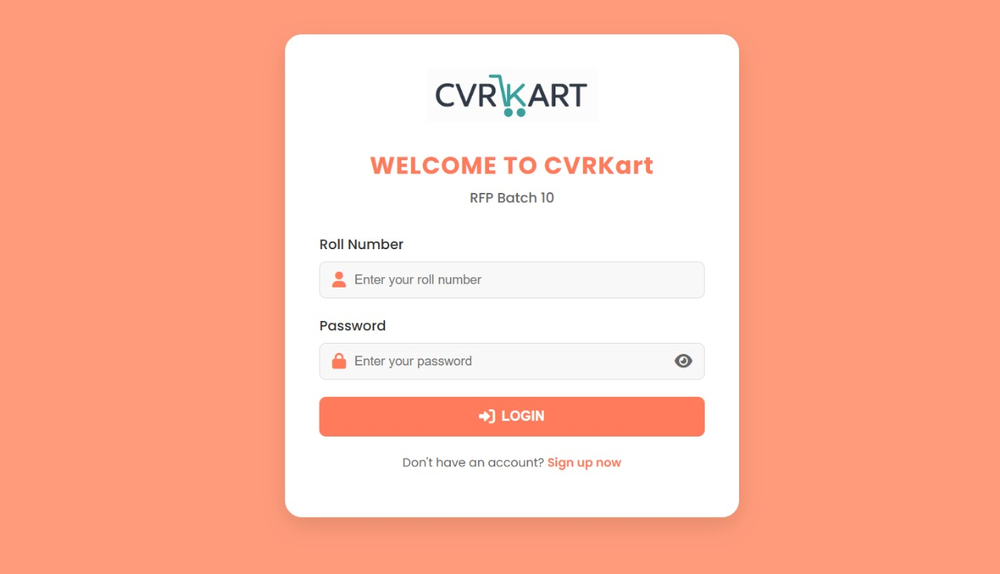

# CVRKart

**A Minimal E-commerce Platform for Grocery Shopping**

CVRKart is a simple, responsive grocery shopping site designed to offer a fast, clutter-free user experience. Built with HTML, CSS, and JavaScript, it serves as a lightweight frontend prototype with secure login and essential cart features.

---

## Features

- Minimalist UI — Clean, intuitive layout optimized for quick access
- Responsive Design — Works seamlessly on desktops, tablets, and mobiles
- Secure Login — Roll-number based login for user-specific access
- Lightweight Architecture — Optimized for low-bandwidth and basic devices
- Cart Functionality — Simulated cart and checkout flow
- Future Ready — Backend support planned for inventory, payments, and analytics

---

## Tech Stack

| Layer       | Technology                         |
|-------------|------------------------------------|
| Frontend    | HTML5, CSS3, JavaScript, Bootstrap |
| Backend     | Python Flask (planned)             |
| Database    | SQLite (dev), PostgreSQL (planned) |
| Hosting     | [Railway](https://railway.app)     |

---

## Screenshots

### Login Page

### Payment Gateway

### Deployment (Railway)

---

## Testing

- Functional testing (forms, navigation, cart)
- Cross-browser compatibility
- Responsive on various devices

---

## Future Scope

- Backend integration with real authentication
- Payment gateway (Razorpay, Stripe)
- Inventory management system
- User dashboards with order history

---

## Authors

- Dhruv Gupta
- B. Hruday Tarang 
- Shaik Irfan
